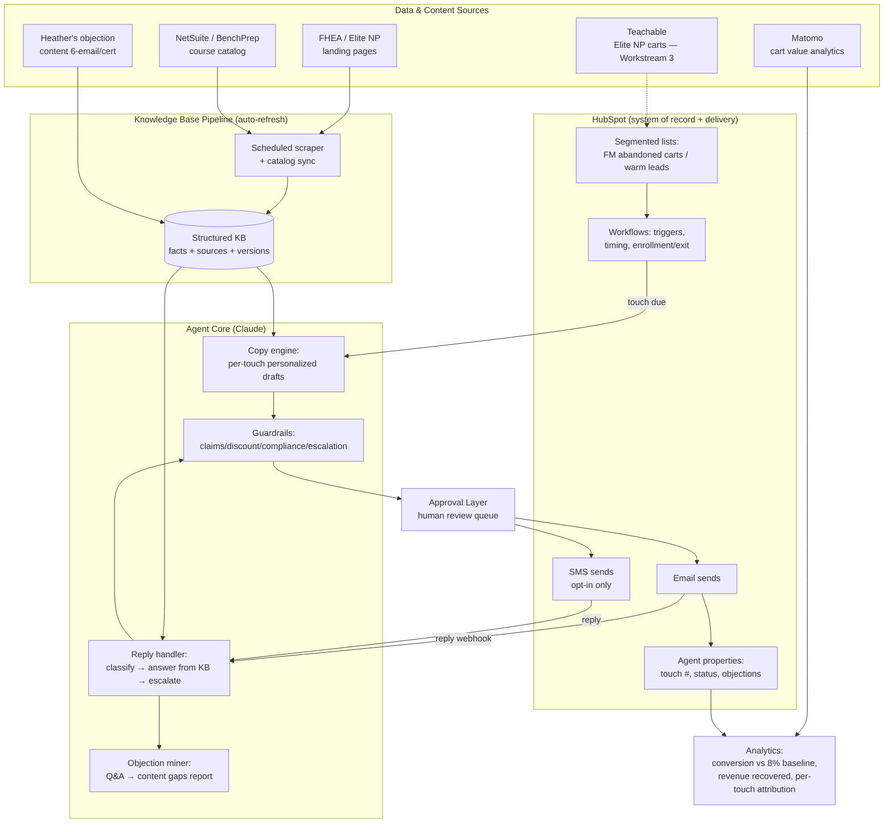

# Architecture — Cert SDR Agent

_Designed 2026-07-28 from the Jul 22 (Yazir/Nader) and Jul 28 (Gail/Heather/Nader) discovery calls. Status: PROPOSED — to be reviewed with Nader/Gail at the Aug 4 kickoff._

## 1. Design Principles

1. **B2C close, not B2B book.** Phase 1 succeeds if the agent gets prospects to *buy* through email/SMS. Meeting-booking (Phase 2) only activates if AI-only retrieval proves insufficient — then an inside sales rep is hired.
2. **HubSpot-native delivery.** Both brands' contacts live in HubSpot; HubSpot has email + SMS (opted-in phone numbers). No new sequencer (no Outreach/Gong Engage), no enrichment tool (no Apollo/ZoomInfo) — Nader explicitly ruled these out. The agent's intelligence lives outside HubSpot; delivery and state live inside it.
3. **Zero hallucination.** Every product claim the agent makes must trace to a knowledge-base entry with a source (landing page, Heather's content, NetSuite catalog). Same rule as ATLAS. Healthcare education audience — no invented stats, no clinical claims.
4. **Auto-refreshing knowledge base.** Gail's hard requirement: no manual feeding. Scrapers + catalog sync keep the KB current when certification content changes.
5. **Human approval first, autonomy earned.** First N sends reviewed (lesson from KELLI/ROBBY/ATLAS: stakeholder voice-fit takes ~2 feedback rounds). Graduate to auto-send per touch-type once approved.
6. **Works in tandem with traditional workflows.** Gail: the agent complements, not replaces, HubSpot marketing workflows and the Ruby on-site advisor. Ruby stays separate (it's the on-site purchase advisor; low engagement today).
7. **Prove lift honestly.** Keep a holdout group on the existing FM workflow so the 8% → 10–12% claim is attributable to the agent, not seasonality.

## 2. System Overview

## 3. Components

### 3.1 HubSpot Layer (system of record)
- **Lists/segments:** FM abandoned-cart segment (exists since Jun 9 for FHEA), warm-leads list (~2,500). Elite NP carts blocked on Teachable→HubSpot capture (Workstream 3).
- **Workflows:** own enrollment, timing (first touch ~15 min after abandonment), exit-on-purchase, exit-on-unsubscribe, and hand-off to the nurture list after the breakup touch.
- **Custom properties:** `cert_sdr_touch`, `cert_sdr_status`, `cert_sdr_last_objection`, `cert_sdr_discount_offered` — so the agent's state is queryable and reportable inside HubSpot.
- **SMS:** HubSpot native texting; only contacts with explicit opt-in; used as a nudge channel (discount reminder), not an education channel — per Nader's design.

### 3.2 Knowledge Base Pipeline (Gail's auto-refresh requirement)
- Scheduled scraper pulls FHEA/Elite NP certification landing pages (what's included, hours, price, format, faculty).
- Heather's per-cert objection content ingested as first-class KB entries (the five objections: *why does this matter / will it actually help me grow / what makes this different / do I have the time / is the cost worth it*).
- NetSuite/BenchPrep catalog sync when courses consolidate there (short-term all certs move to NetSuite per Gail).
- Every KB fact carries `source_url`, `retrieved_at`, `cert_id`. Agent can only cite facts present in the KB — unknown question → graceful "let me get you that" + escalation, never a guess.
- Refresh cadence: daily scrape diff; changed content flags a review item rather than silently changing live copy.

### 3.3 Agent Core (Claude)
- **Copy engine:** generates per-touch drafts personalized by cert, list source, pain-point archetype (FHEA = competency gap for patient care; Elite NP = new revenue stream for their practice), and current-state→future-state transformation stories.
- **Reply handler:** webhook on email/SMS replies → classify (question / objection / buying signal / opt-out / unrelated) → answer grounded in KB → or escalate to a human (Yazir will designate a trained fallback person).
- **Objection miner:** every inbound question is logged; weekly digest to Heather/Gail = "what buyers are actually asking" (the survey effect Gail wants) → feeds content roadmap and Ruby/site copy.
- **Guardrails:** no clinical/medical claims beyond KB facts; discount capped at the approved 10% and offered only at the designated touches; mandatory unsubscribe/STOP handling; brand voice rules per brand (FHEA ≠ Elite NP — different audiences, own websites).

### 3.4 Approval Layer
- Review queue (Airtable, same pattern as KELLI/ATLAS) for: all sequence templates before launch, and the first ~50 AI reply drafts.
- Graduation rule: a touch-type or reply-category goes autonomous after stakeholder sign-off, mirroring the "Kelli approval is the only success gate" lesson from FHEA SDR.

### 3.5 Analytics
- Dashboard: conversion rate vs 8% baseline (with holdout), revenue recovered, reply rate, per-touch attribution, SMS vs email contribution, objection frequency.
- Matomo remains the cart-value source (Products → abandoned carts view Gail demonstrated: $2.8M FM in July).

## 4. Candidate Build Shapes (decision at Aug 4 kickoff)

| Option | Shape | Pros | Cons |
|---|---|---|---|
| **A. HubSpot-workflow + Claude skill via HubSpot MCP** (Gail/Nader's instinct) | Workflows fire; Claude skill drafts/answers through HubSpot MCP; operator-in-the-loop in Claude | Fastest; no infra; reuses ATLAS skill pattern; Gail can co-own | Reply handling is semi-manual until a worker exists |
| **B. Cloudflare Worker service (ATLAS pattern)** | Worker receives HubSpot webhooks, calls Claude API, writes back via HubSpot API; MCP endpoint for ops | Fully autonomous replies; proven deploy template (`atlas.colibrigroup.tech`) | More build; needs IT/publish path Gail flagged |
| **C. On-site slide-in chat (Gail's addition)** | KB-grounded Q&A widget on cart/landing page after 30s | Catches buyers *before* abandonment | Overlaps Ruby; defer to Phase 1.5 to avoid confusing the test |

**Recommendation: A for sprint week 1 (sequences live fast), B for week 2 (autonomous reply handling), C deferred.** This matches the two-week sprint and lets us show conversion movement before Yazir returns from PTO.

## 5. Phases & Workstreams

**Gail's three workstreams:**
1. Abandoned-cart agentic flows (this repo, FM/FHEA first)
2. Content/KB build-out (Heather-led, agent-accelerated)
3. Elite NP cart capture: Teachable → HubSpot (prerequisite for ENP rollout)

**Phase plan:**
- **Phase 1 (2-week sprint):** FM/FHEA abandoned carts, 7-touch email+SMS, KB v1, approval queue, dashboard. Pure AI close.
- **Phase 1.5:** warm-leads nurture track (2,500 list — education/case-study campaign the breakup touch feeds into), remaining FHEA certs, on-site slide-in decision.
- **Phase 2 (only if AI-only retrieval underperforms):** meeting-booking CTA + trained human responder → inside sales rep.

## 6. Compliance & Risk

- **TCPA:** SMS only to explicit opt-ins, quiet hours, STOP honored instantly.
- **CAN-SPAM:** working unsubscribe, physical address, honest subject lines.
- **Deliverability:** throttled sends, warm domain, monitor spam complaints — this list is warm but fatigued (Elite NP FM audience may be oversaturated per Gail).
- **Discount governance:** 10% only, at designated touches, coded per-contact to prevent stacking/leakage.
- **Attribution risk:** without a holdout, the existing Jun-9 FM workflow contaminates the lift claim — run agent vs workflow split.
- **Data gaps:** Elite NP carts invisible to HubSpot until Workstream 3; exact abandoned-cart numbers inconsistent between calls ($295K/74-person flow vs $1M vs $2.8M July Matomo — business case must reconcile which cut is which).

## 7. What We Reuse From Existing Agents

| From | What |
|---|---|
| ATLAS | Cloudflare Worker + MCP + skill deploy template, zero-hallucination sourcing rule, approval-before-send gates, analytics tooling |
| KELLI (FHEA SDR) | Same brand family; stakeholder voice-rule workflow, Airtable review queue, QA rubric approach, "stakeholder approval is the only gate" |
| ROBBY (Moreland) | B2C lessons: B2B/B2C contact distinctions in CRM, greeting/personalization pitfalls, phone-format handling |

**What is deliberately NOT reused:** enrichment stack (Apollo/ZeroBounce waterfalls), Outreach sequencer, bank/territory logic — this is a warm B2C lifecycle motion, not cold B2B outbound.
