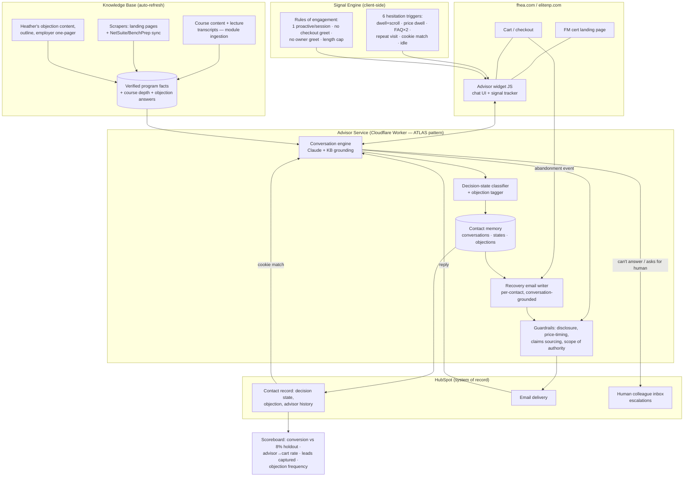

# Architecture — FM Program Advisor (AI SDR)

_Rev 2.1 — 2026-08-20, redesigned around Gail Applin's Aug 17 product vision ([docs/VISION.md](docs/VISION.md)) and amended per [stakeholder feedback 2026-08-20](docs/FEEDBACK-2026-08-20.md): one agent, one identity, three touchpoints; 6 triggers; recovery email covers non-engaged NPs; KB ingests course content + transcripts. Supersedes the July email-sequence-first design (preserved in git history)._

## 1. What Changed From Rev 1

Rev 1 (July) was an email/SMS abandoned-cart sequence with a deferred "maybe later" on-site widget. The Aug 17 vision inverts that: **the on-site conversational advisor is the product**, and the recovery email is no longer a pre-written sequence — it is **written per-contact by the same agent that had the conversation**. What survives from Rev 1: HubSpot as system of record, the auto-refreshing knowledge base, zero-hallucination sourcing, human approval before autonomy, and the holdout-group measurement discipline.

## 2. Design Principles

1. **One agent, one identity, one memory.** Not three automations. The advisor has a name, a consistent voice, memory of every prior interaction with a contact, and a defined scope of authority. She discloses she's an AI with a human colleague one message away.
2. **Greet on evidence of hesitation, never on page load.** The failure mode of proactive chat is interrupting converters and ignoring the stuck. Six behavioral triggers (vision §3.1 minus the two removed Aug 20) gate every proactive contact.
3. **Objection-sequenced selling.** Decision-state classification drives what the agent talks about and *withholds* — price is never raised with a Clinically Curious NP until rigor is resolved.
4. **Zero hallucination — and real course depth.** Every product claim traces to a KB fact with a source. The KB is seeded from the vision doc's verified facts (95 contact hours, IACET, 24 pharm hours, module list, Jenni Gallagher MSN NP-C, 1-year access, 3–6 month completion, Affirm on FHEA only) **and fed by the actual course content and lecture transcripts** (Aug 20 feedback) — so the advisor can answer "how deep does the lab-interpretation module actually go?" from the module itself. Unknown → offer the human colleague, never guess.
5. **The email is a continuation, not a campaign.** Recovery emails reference the actual objection from the conversation, answer it, and the sequence stops the moment it's resolved (reply, purchase, or objection cleared). If she never engaged with the agent, the email instead invites her to — grounded in what she viewed and where she stalled.
6. **Respectful by construction.** One proactive attempt per session; silent after dismissal; never proactive on checkout; never greets existing cert owners; hard message-length cap; instant unsubscribe/STOP.
7. **Prove lift honestly.** Holdout on the existing generic flow; conversion, cart-rate, and lead-capture measured against it.

## 3. System Overview

## 4. Components

### 4.1 Advisor Widget (client-side, both sites)
- Embeddable JS snippet on `/functional-medicine-certification/` pages and cart/checkout on fhea.com + elitenp.com. The fhea.com cert page is **WordPress** — Devin (IT) may be able to deploy the snippet (Aug 20 feedback).
- **Signal tracker** implements the 6-trigger inventory with exact thresholds: 45s dwell + 60% scroll no-CTA · 10s price-block dwell · 2× FAQ opens · repeat visit ≤14 days · HubSpot cookie match · 90s idle. (Paid-search cost-intent and copy/print triggers removed per Aug 20 feedback.)
- Each trigger maps to a **specific opening move** (e.g. price-dwell → lead with total cost + Affirm monthly figure unprompted; cookie match → skip discovery, reference what she already told us).
- Enforces rules of engagement client-side: one proactive attempt/session, silent after dismissal, suppressed on checkout and for logged-in cert owners.

### 4.2 Advisor Service (Cloudflare Worker — reuses ATLAS deploy template)
- **Conversation engine:** Claude, grounded exclusively in KB facts; hard message-length cap; always-on AI disclosure in the greeting; "human colleague one message away" escalation to a named person (Yazir designates).
- **Decision-state classifier:** tags each contact's state (first archetype: *Clinically Curious* — objection: rigor; more archetypes to be defined with Gail as vision v2 sections land) and primary objection. Tags write to HubSpot.
- **Contact memory:** every conversation, state, objection, and delivered asset stored per contact — cookie-matched returning visitors get continuity ("skip discovery, reference what she already told us").
- **Guardrails:** price-timing per decision state, sourced-claims-only, defined scope of authority (what she may promise: outline delivery, invoice, one-pager, Affirm figures; what she may not: unlisted discounts, clinical advice, accreditation claims beyond KB).

### 4.3 Recovery Email Writer (Touchpoint 3)
- On abandonment, the agent drafts the email **from the contact's own conversation**: subject references her actual objection; body answers it; CTA matches her decision state.
- **Non-engaged NP** (never talked to the agent — Aug 20 feedback): the agent still writes her a per-contact email, grounded in what she viewed and where she stalled, **inviting her to interact with the agent** to get her questions answered and complete the purchase. Never a static template.
- Sequence continues with agent-written follow-ups and **stops immediately** on reply, purchase, or objection resolution. Replies route back into the same conversation engine.
- Delivered through HubSpot; human approval queue for the first ~50 generated emails, then graduated autonomy (KELLI lesson: stakeholder sign-off is the only gate).

### 4.4 Knowledge Base (auto-refresh — Gail's standing requirement)
- **Primary source (Aug 20 feedback): the course itself.** The agent ingests the actual course content and lecture transcripts, module by module — this feeds the course facts and lets the advisor answer depth questions ("what does the lab-interpretation module actually cover?") from the source material. Access path (LMS export vs Teachable/NetSuite/BenchPrep API) is an open question.
- Seeded with verified facts from the vision doc (see [docs/VISION.md](docs/VISION.md) KB-seed section); Gail confirms the fact seed.
- Scrapers watch both landing pages; NetSuite/BenchPrep catalog sync when courses consolidate; Heather's objection content and assets (module outline, employer one-pager) as first-class entries.
- Changed source content flags a review item — never silently changes live agent behavior.

### 4.5 Measurement
- Scoreboard: cart conversion vs 8% holdout, advisor-conversation → add-to-cart rate, leads captured from hesitating visitors, recovery-email reply/close rate, objection & decision-state frequencies (the marketing survey effect).
- Matomo stays the cart-value source; HubSpot properties carry per-contact agent state.

## 5. Build Plan

| Phase | Scope | Depends on |
|---|---|---|
| **P1 — Recovery email writer** | Touchpoint 3 on existing FM/FHEA cart data: agent-written recovery + invite-to-chat emails via HubSpot, approval queue, holdout, scoreboard | HubSpot access; **KB v1 incl. course content + transcripts**; no site changes needed — ship first |
| **P2 — Landing page advisor** | Widget + signal engine (6 triggers) + conversation service on fhea.com FM page; lead capture; decision-state tagging | JS snippet on the WordPress page (Devin/IT); persona name approved (Heather/Yazir) |
| **P3 — Cart & checkout rescue** | Exit-intent / payment-stall / coupon-hunt interventions | P2 infrastructure; checkout-page event access |
| **P4 — Full loop + rollout** | Conversation-grounded emails (P2 memory feeding P1 writer), elitenp.com, then other certifications | All prior; Teachable→HubSpot cart capture for Elite NP |

P1 first because it needs no website deployment and directly attacks the measured $2.8M/8% problem; P2/P3 land the vision's differentiator; P4 closes the loop where the email continues the chat.

## 6. Compliance & Risk

- **AI disclosure always** (in the greeting, by design — vision requirement, and good law: bot-disclosure rules).
- **CAN-SPAM / list hygiene** on recovery emails; instant unsubscribe; sequence stops on resolution.
- **No clinical advice, no accreditation over-claims** — sourced facts only; escalate to human colleague.
- **Privacy:** behavioral triggers use first-party site signals + HubSpot cookie match only; disclose in privacy policy; honor consent state.
- **Persona honesty:** named persona is fine, pretending to be human is not — she says she's an AI.
- **Widget performance:** snippet must not degrade page speed (it's a revenue page) — async load, size budget.
- **Data gaps carried from July:** Elite NP carts still in Teachable (P4 blocker); $295K/$1M/$2.8M figures still need reconciliation in the business case.

## 7. Reuse

| From | What |
|---|---|
| ATLAS | Cloudflare Worker deploy template + CI, zero-hallucination sourcing, approval gates |
| KELLI | Stakeholder voice-approval workflow, review queue, QA rubric |
| Rev 1 (this repo) | KB pipeline design, HubSpot property scheme, holdout methodology, business-case math |
